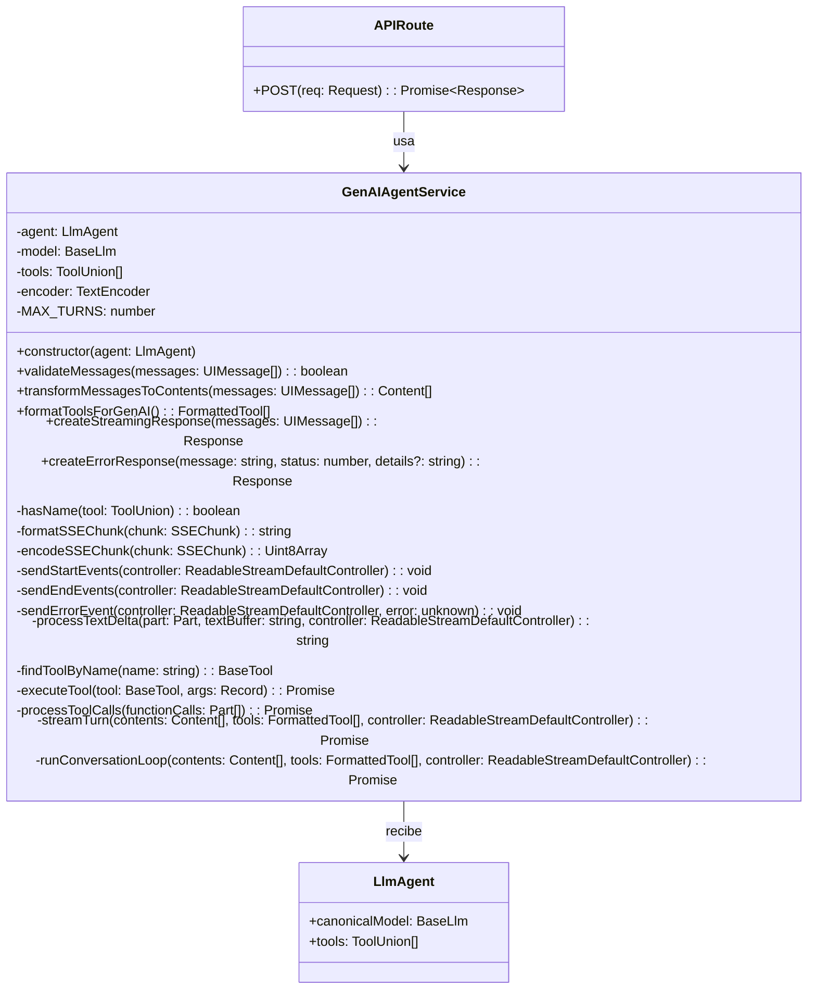
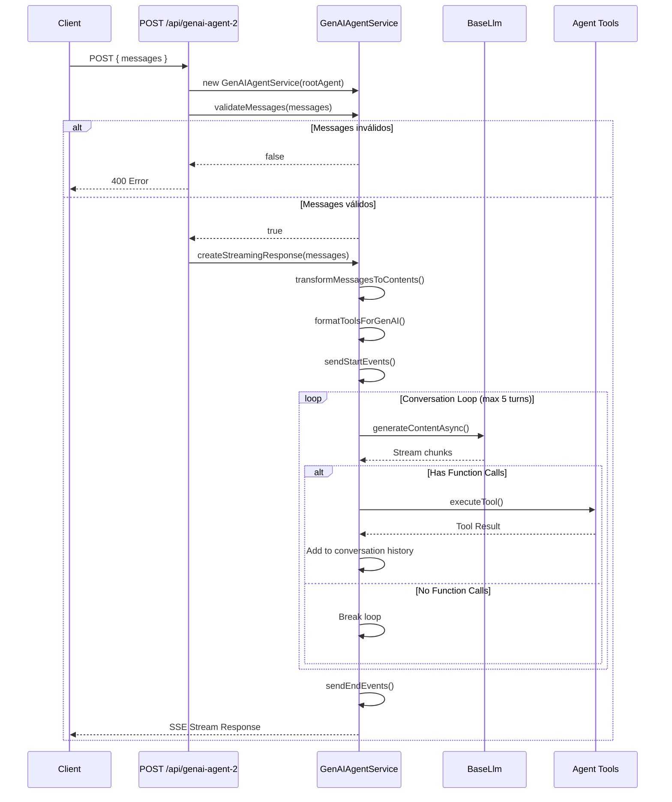
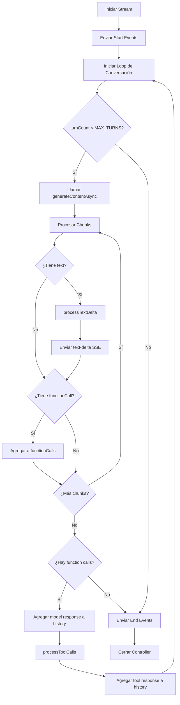

# GenAI Agent Service

## Diagrama de Clases



## Diagrama de Secuencia - Flujo de Request



## Diagrama de Flujo - Procesamiento de Streaming



## Métodos de la Clase

### Métodos Públicos

| Método | Descripción |
|--------|-------------|
| `validateMessages()` | Valida que el array de mensajes exista y no esté vacío |
| `transformMessagesToContents()` | Convierte `UIMessage[]` de Vercel AI SDK a `Content[]` de ADK |
| `formatToolsForGenAI()` | Adapta las herramientas del agente al formato esperado por GenAI |
| `createStreamingResponse()` | Crea la respuesta SSE con streaming completo |
| `createErrorResponse()` | Método estático para generar respuestas de error HTTP |

### Métodos Privados

| Método | Descripción |
|--------|-------------|
| `hasName()` | Type guard para verificar si una tool tiene propiedad `name` |
| `formatSSEChunk()` | Formatea un chunk para SSE (`data: {...}\n\n`) |
| `encodeSSEChunk()` | Codifica un chunk SSE a `Uint8Array` |
| `sendStartEvents()` | Envía eventos SSE de inicio (`start`, `start-step`, `text-start`) |
| `sendEndEvents()` | Envía eventos SSE de fin (`text-end`, `finish-step`, `finish`) |
| `sendErrorEvent()` | Envía evento SSE de error |
| `processTextDelta()` | Procesa deltas de texto evitando duplicados (comportamiento Gemini) |
| `findToolByName()` | Busca una herramienta por nombre |
| `executeTool()` | Ejecuta una herramienta y retorna el resultado |
| `processToolCalls()` | Procesa múltiples llamadas a funciones |
| `streamTurn()` | Ejecuta un turno de streaming y recolecta function calls |
| `runConversationLoop()` | Ejecuta el loop multi-turno completo |

## Uso

```typescript
import { rootAgent } from '@/app/agents/agent1';
import { GenAIAgentService } from '@/app/lib/genai-agent-service';

// En la API route
const service = new GenAIAgentService(rootAgent);

if (!service.validateMessages(messages)) {
  return GenAIAgentService.createErrorResponse('Messages are required', 400);
}

return service.createStreamingResponse(messages);
```
