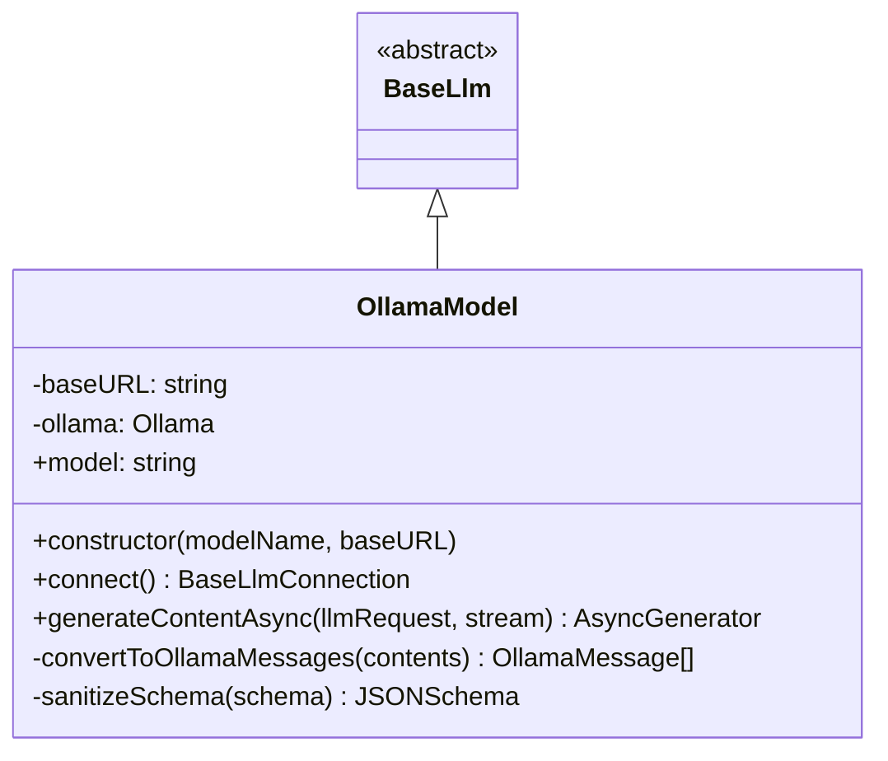

# Documentación Técnica: Clase `OllamaModel`

La clase `OllamaModel` es una implementación personalizada que extiende `BaseLlm` del Google Agent Development Kit (ADK). Su propósito es permitir la integración fluida de modelos de lenguaje locales o remotos servidos a través de **Ollama** dentro del ecosistema ADK.

## Características Principales
- Soporte para **Streaming**: Generación de respuestas en tiempo real.
- Soporte para **Tool Calling**: Integración con funciones externas mediante la API de Ollama.
- Compatibilidad con el formato de mensajes de Google ADK.
- Configurable para endpoints locales o remotos.

## Definición de la Clase

### Constructor
```typescript
constructor(modelName: string = 'qwen3:0.6b', baseURL: string = 'http://localhost:11434/v1')
```
- `modelName`: Nombre del modelo en Ollama (por defecto `qwen3:0.6b`).
- `baseURL`: URL del servidor Ollama (por defecto apuntando a la API local).

### Métodos Públicos

#### `generateContentAsync(llmRequest: LlmRequest, stream: boolean = true): AsyncGenerator<LlmResponse, void>`
Genera contenido basado en una solicitud ADK.
- **Entrada**: `LlmRequest` que contiene el historial de mensajes, configuración y herramientas.
- **Salida**: Un generador asíncrono que emite objetos `LlmResponse`.
- **Lógica**: Convierte los mensajes al formato de Ollama, procesa las definiciones de herramientas y gestiona tanto la respuesta por streaming como la respuesta completa.

#### `connect(): Promise<BaseLlmConnection>`
- Método heredado de `BaseLlm`. Actualmente lanza un error ya que las conexiones en vivo persistentes no están soportadas para esta implementación.

### Métodos Privados

#### `convertToOllamaMessages(contents: Content[]): OllamaMessage[]`
Transforma los objetos de contenido de ADK (`Content`) al formato esperado por la librería `ollama`. Maneja roles (user, model/assistant, tool) y extrae llamadas a funciones.

#### `sanitizeSchema(schema: JSONSchema | undefined): JSONSchema | undefined`
Asegura que los esquemas JSON de las herramientas sean compatibles con Ollama, convirtiendo tipos (como `String` a `string`) a minúsculas.

## Diagrama UML



## Ejemplo de Uso

```typescript
import { OllamaModel } from '@yagolopez/adk-utils';

async function main() {
  // Instanciar el modelo (por defecto usa qwen3:0.6b en localhost)
  const model = new OllamaModel('llama3');

  const request = {
    contents: [
      { role: 'user', parts: [{ text: '¿Qué es el Agent Development Kit de Google?' }] }
    ]
  };

  console.log('Generando respuesta...');

  for await (const response of model.generateContentAsync(request)) {
    if (response.content?.parts[0] && 'text' in response.content.parts[0]) {
      process.stdout.write(response.content.parts[0].text);
    }
  }
}

main().catch(console.error);
```

---

## Dependencias
- `@google/adk`: Provee la clase base y tipos de datos.
- `ollama`: Cliente oficial de Node.js para interactuar con el servidor Ollama.
- `@google/genai`: Tipos adicionales para compatibilidad de contenido.
