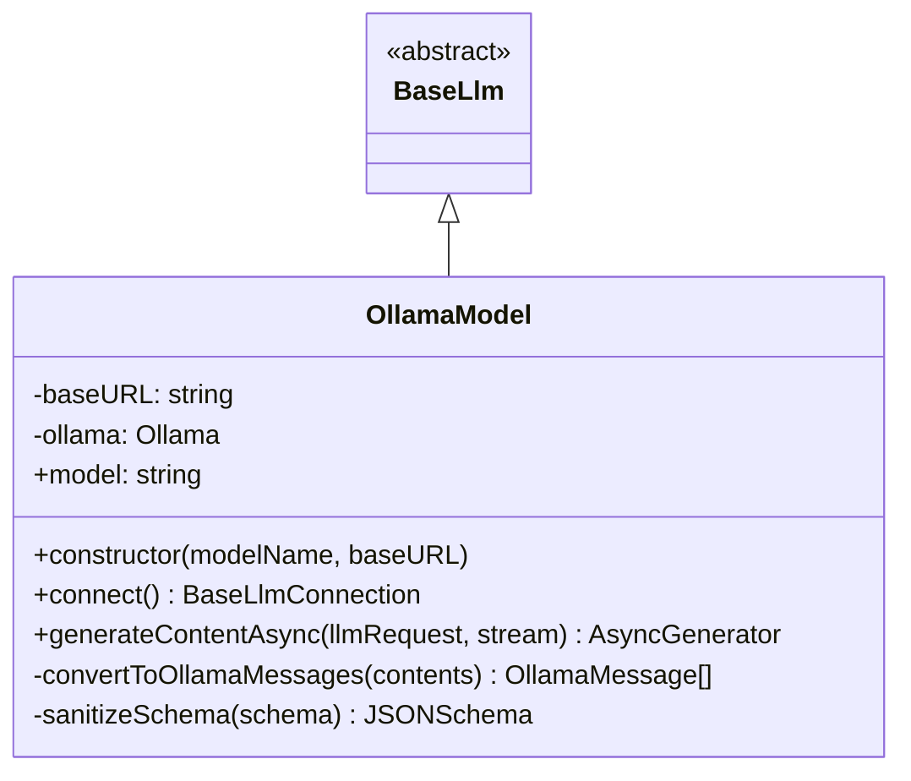

# Technical Documentation: `OllamaModel` Class

The `OllamaModel` class is a custom implementation that extends `BaseLlm` from the Google Agent Development Kit (ADK). Its purpose is to enable seamless integration of local or remote language models served via **Ollama** within the ADK ecosystem.

## Key Features
- **Streaming** Support: Real-time response generation.
- **Tool Calling** Support: Integration with external functions through the Ollama API.
- Compatibility with Google ADK message formats.
- Configurable for local or remote endpoints.

## Class Definition

### Constructor
```typescript
constructor(modelName: string = 'qwen3:0.6b', baseURL: string = 'http://localhost:11434/v1')
```
- `modelName`: Name of the model in Ollama (defaults to `qwen3:0.6b`).
- `baseURL`: URL of the Ollama server (defaults to pointing to the local API).

### Public Methods

#### `generateContentAsync(llmRequest: LlmRequest, stream: boolean = true): AsyncGenerator<LlmResponse, void>`
Generates content based on an ADK request.
- **Input**: `LlmRequest` containing message history, configuration, and tools.
- **Output**: An asynchronous generator that emits `LlmResponse` objects.
- **Logic**: Converts messages to Ollama format, processes tool definitions, and manages both streaming and complete responses.

#### `connect(): Promise<BaseLlmConnection>`
- Inherited method from `BaseLlm`. Currently throws an error as persistent live connections are not supported in this implementation.

### Private Methods

#### `convertToOllamaMessages(contents: Content[]): OllamaMessage[]`
Transforms ADK content objects (`Content`) into the format expected by the `ollama` library. It handles roles (user, model/assistant, tool) and extracts function calls.

#### `sanitizeSchema(schema: JSONSchema | undefined): JSONSchema | undefined`
Ensures that tool JSON schemas are compatible with Ollama, converting types (such as `String` to `string`) to lowercase.

## UML Diagram



## Usage Example

```typescript
import { OllamaModel } from '@yagolopez/adk-utils';

async function main() {
  // Instantiate the model (defaults to qwen3:0.6b on localhost)
  const model = new OllamaModel('llama3');

  const request = {
    contents: [
      { role: 'user', parts: [{ text: 'What is Google\'s Agent Development Kit?' }] }
    ]
  };

  console.log('Generating response...');

  for await (const response of model.generateContentAsync(request)) {
    if (response.content?.parts[0] && 'text' in response.content.parts[0]) {
      process.stdout.write(response.content.parts[0].text);
    }
  }
}

main().catch(console.error);
```

---

## Dependencies
- `@google/adk`: Provides the base class and data types.
- `ollama`: Official Node.js client for interacting with the Ollama server.
- `@google/genai`: Additional types for content compatibility.
